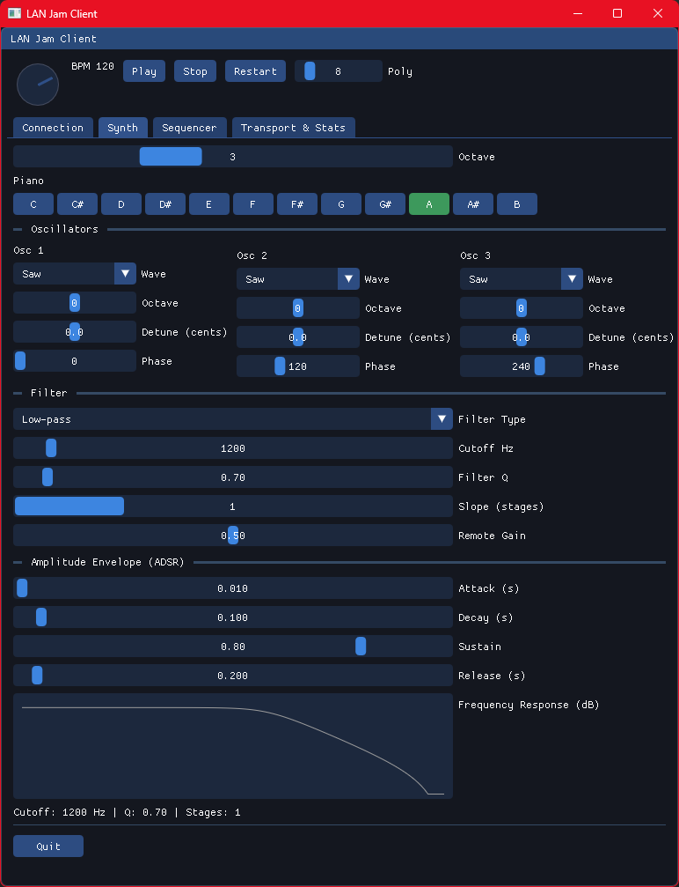
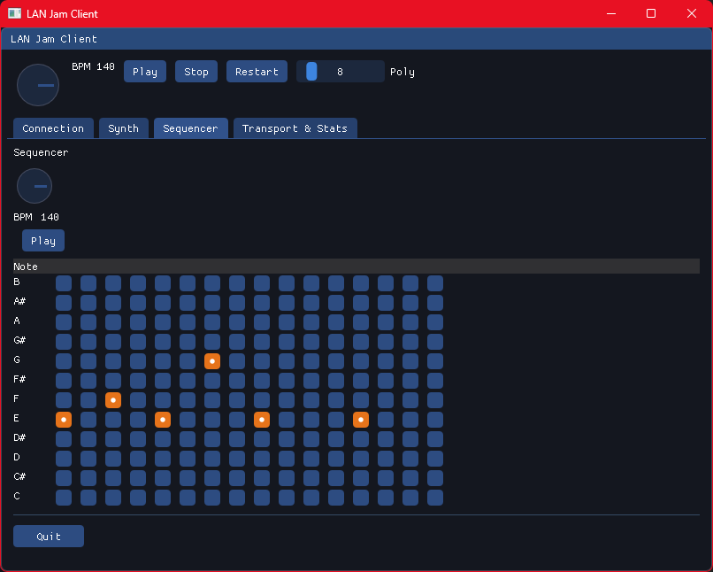
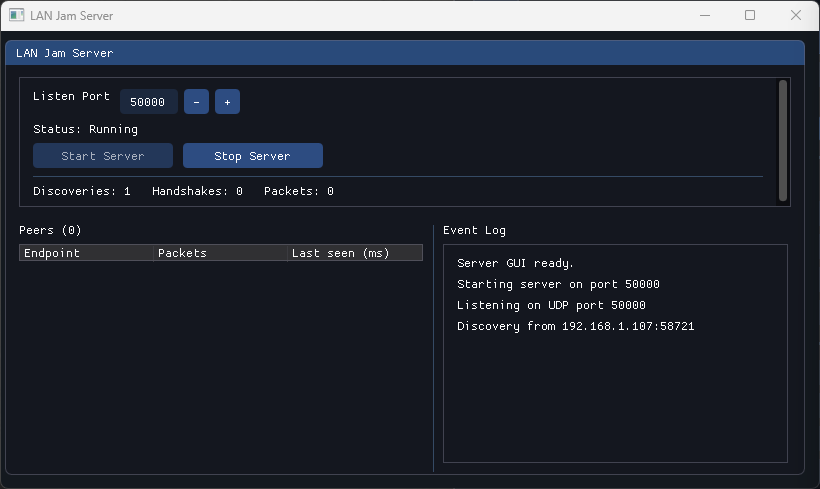

# LANjam

LANjam is a compact LAN jam-session prototype: a UDP relay server plus lightweight clients that synthesize and exchange raw PCM audio. Each client renders a local synth voice for zero-latency monitoring while mixing remote audio from peers.

This README has been updated to reflect the current app state (GUI layout, sequencer, polyphony, and discovery improvements).

## Highlights / Current State
- UDP fan-out relay server and a GUI server dashboard.
- GUI client with a single anchored main window (no floating elements) built on Dear ImGui + GLFW.
- Local synth with ADSR envelope, multiple oscillators, and a simple polyphonic voice pool (configurable poly count).
- Sample-accurate sequencer (12 rows × 16 steps) driven from the audio callback. Steps can trigger multiple rows (chords).
- Visual sequencer: active steps are shown in orange with a centered dot; active playhead column is highlighted.
- Tempo control is a rotary BPM knob placed inline with Play/Stop/Restart and polyphony controls.
- One-click LAN discovery to find servers on the subnet and resilient hostname resolution for manual connect.

## Features (detailed)
- Low-latency UDP transport with a lightweight fan-out relay server.
- Simple jitter buffer and per-client mixing (server side).
- Local zero-latency monitoring: clients synthesize locally and send raw PCM to the server.
- Polyphony via an audio-thread voice pool with LRU stealing when voices are exhausted.
- ADSR amplitude envelope exposed in the GUI.
- Sample-accurate sequencer (audio-thread timing) with editable grid UI; supports chords.
- GUI improvements: single, window-locked UI, rotary BPM knob, per-step visual feedback.
- Build with CMake + vcpkg-managed dependencies (RtAudio, ImGui, GLFW, GLAD, Asio).

## Prerequisites
- CMake 3.25+
- A C++20 compiler (MSVC 2022 recommended on Windows)
- [vcpkg](https://github.com/microsoft/vcpkg) in manifest mode; set `VCPKG_ROOT` in your environment so CMake can find it

## Configure & Build
From the repository root:
```powershell
# Configure
cmake -B build -S . -DCMAKE_BUILD_TYPE=Release
# Build (Release)
cmake --build build --config Release
```

For development use `Debug` instead of `Release`. Binaries are produced under `build/Release/` or `build/Debug/`.

## Run
- Server (headless): `lan_jam_server.exe <port>` (default 50000)
- Server dashboard: `lan_jam_server_gui.exe`
- GUI client: `lan_jam_client_gui.exe` (optionally `lan_jam_client_gui.exe <server_ip> [port]`)
- Headless client: `lan_jam_client.exe`

## Quick Test (single-machine)
1. Start the server:
```powershell
.\build\Release\lan_jam_server.exe 50000
```
2. Start a client:
```powershell
.\build\Release\lan_jam_client_gui.exe
```
3. In the GUI, connect to `127.0.0.1:50000` (or use Discover LAN). You should hear your local synth immediately.
4. Start a second client to hear remote audio mixed in (slightly delayed) so you can validate network flow.

## Notes & Tips
- If audio glitches:
	- Increase the audio buffer size in `src/audio/AudioIO.cpp` (e.g., 128 -> 256 frames).
	- Lower synth gain in `src/audio/SynthVoice.cpp`.
	- Prefer wired Ethernet for low jitter.

## Roadmap / Next Work
- Add Opus encoding for bandwidth reduction and improved jitter handling.
- Expand synth features: LFOs, more waveforms, unison, effects.
- Add MIDI input mapping and presets persistence.
- Improve server-side mixing/metering and provide more network diagnostics in the GUI.

## Screenshots






