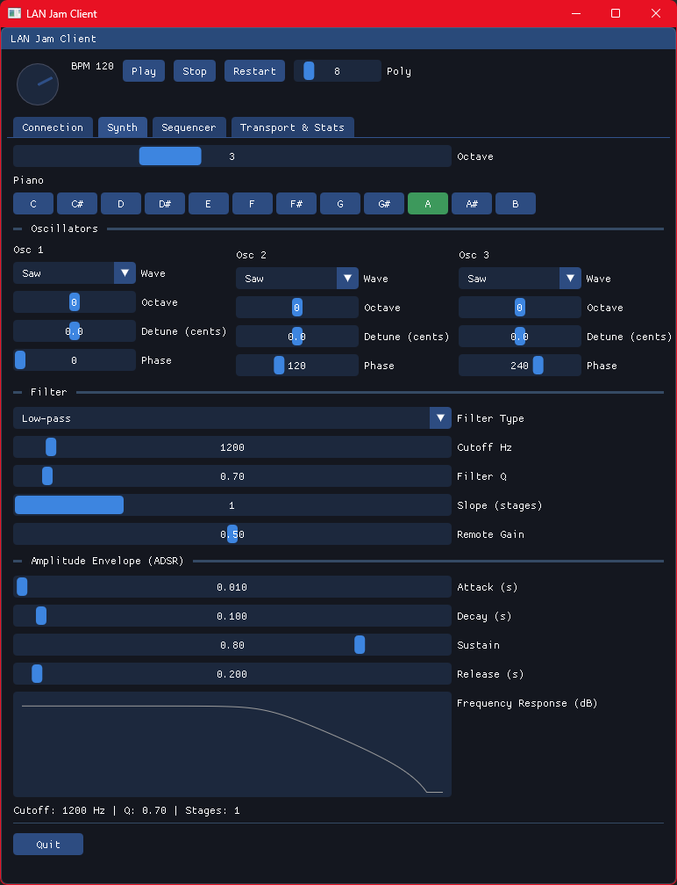
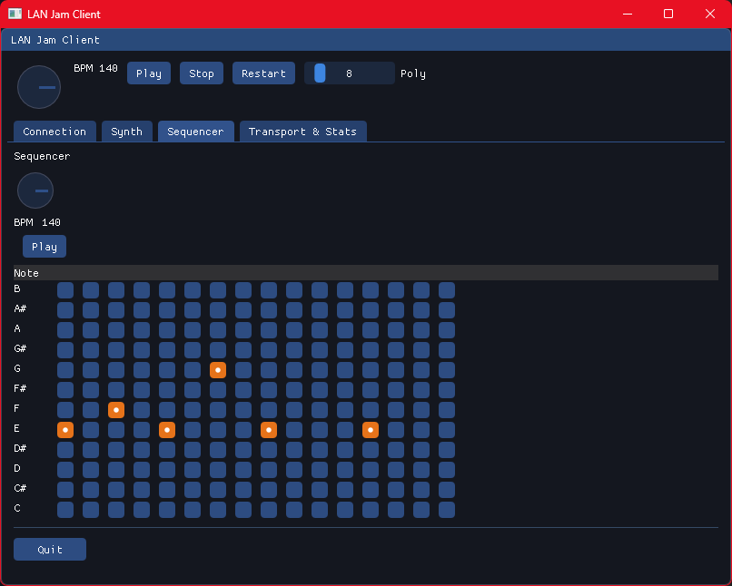
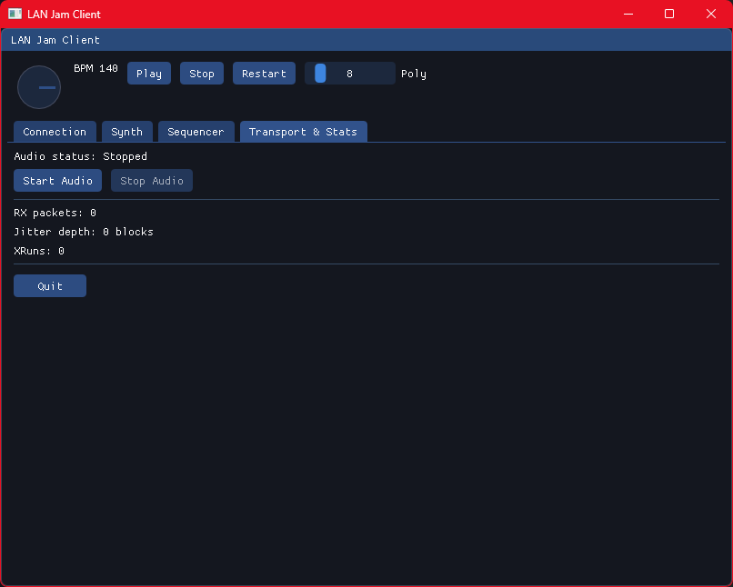
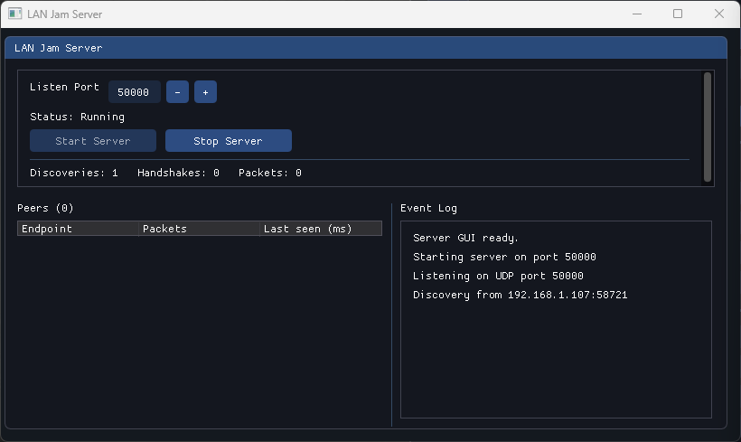

# LANjam

LANjam is a compact LAN jam-session prototype: a UDP relay server plus lightweight clients that synthesize and exchange raw PCM mono audio. Each client renders a local synth for monitoring while mixing remote audio from peers (via the relay).

## Highlights

- UDP fan-out relay server and a GUI server dashboard.
- GUI client: single anchored main window (Dear ImGui + GLFW + OpenGL), discovery, connection tab, synth controls, sequencer, and **Transport & Stats** (network + optional CUDA telemetry).
- **CPU path:** polyphonic voice pool (GUI poly count), ADSR, three oscillators, biquad-style filter as implemented in `SynthVoice`.
- **Optional CUDA path:** prototype GPU renderer (multi-osc + ADSR + simple 1-pole low-pass when filter type is low-pass). Select at runtime with an environment variable; falls back to CPU if CUDA fails or exceeds a block-time budget.
- Sample-accurate sequencer (12 rows × 16 steps) driven from the audio callback; chords supported.
- CMake + **vcpkg manifest** (`vcpkg.json`): Asio, RtAudio, GLFW3, GLAD, ImGui.

## Prerequisites

- **CMake** 3.25+
- **C++20** toolchain (MSVC 2022 is what we use on Windows)
- **vcpkg** available on your machine; set **`VCPKG_ROOT`** so CMake can use the toolchain file (the top-level `CMakeLists.txt` picks it up automatically when the variable is set).
- For **CUDA builds:** NVIDIA CUDA Toolkit (CMake `find_package(CUDAToolkit)`), and configure with `-DLANJAM_ENABLE_CUDA=ON`.

## Configure and build (Windows)

Use a **Visual Studio** generator so MSVC and the Windows SDK are wired correctly (recommended). Example: build under `out/build` (ignored by git):

```powershell
cmake -S . -B "out/build/vs2022-x64" -G "Visual Studio 17 2022" -A x64 `
  -DCMAKE_TOOLCHAIN_FILE="$env:VCPKG_ROOT\scripts\buildsystems\vcpkg.cmake"

cmake --build "out/build/vs2022-x64" --config Debug
```

**CUDA-enabled binaries** (same layout, separate build directory):

```powershell
cmake -S . -B "out/build/vs2022-x64-cuda" -G "Visual Studio 17 2022" -A x64 `
  -DCMAKE_TOOLCHAIN_FILE="$env:VCPKG_ROOT\scripts\buildsystems\vcpkg.cmake" `
  -DLANJAM_ENABLE_CUDA=ON

cmake --build "out/build/vs2022-x64-cuda" --config Debug
```

Release builds: use `--config Release` and run executables from `out/build/<dir>/Release/`.

If `CMAKE_TOOLCHAIN_FILE` is omitted, `find_package` for vcpkg ports (e.g. GLAD) may fail unless dependencies are already on `CMAKE_PREFIX_PATH`.

## Audio backend selection (GUI client)

The GUI client chooses the renderer implementation at startup:

| `LANJAM_AUDIO_BACKEND` | Behavior |
|------------------------|----------|
| *(unset)* or `cpu`    | `CpuPolyRenderer` (full CPU synth). |
| `cuda`                 | `CudaPolyRenderer` (GPU prototype when built with `LANJAM_ENABLE_CUDA=ON`; otherwise effectively CPU-equivalent / stub path). |

PowerShell example:

```powershell
$env:LANJAM_AUDIO_BACKEND = "cuda"
.\out\build\vs2022-x64-cuda\Debug\lan_jam_client_gui.exe
```

With CUDA enabled, **Transport & Stats** shows render time vs. block budget, fallback counters, and a small moving-average sparkline of GPU render time.

## Run

| Binary | Role |
|--------|------|
| `lan_jam_server.exe` [port] | Headless relay (default port `50000`). |
| `lan_jam_server_gui.exe` | Server with dashboard. |
| `lan_jam_client_gui.exe` | GUI client (connect / discover from the UI; no required CLI args). |
| `lan_jam_client.exe <server_ip> <server_port>` | Headless client for quick tests. |

Paths above are relative to your build output directory (e.g. `out/build/vs2022-x64/Debug/`).

## Quick test (single machine)

1. Start the relay:

   ```powershell
   .\out\build\vs2022-x64\Debug\lan_jam_server.exe 50000
   ```

2. Start the GUI client (from the same build tree):

   ```powershell
   .\out\build\vs2022-x64\Debug\lan_jam_client_gui.exe
   ```

3. In the app, set server to `127.0.0.1` and port `50000`, or use **Discover LAN**.

4. Open a second client to verify remote audio is mixed in (with jitter-buffer delay).

## Troubleshooting

- **Audio glitches:** try a larger buffer in `AudioIO::open` (e.g. 128 → 256 frames); reduce levels in the synth; prefer wired Ethernet.
- **CMake cannot find `glad` / vcpkg packages:** pass `-DCMAKE_TOOLCHAIN_FILE=.../vcpkg.cmake` and ensure manifest install has run once for that build tree.
- **CUDA build / runtime:** ensure `LANJAM_ENABLE_CUDA=ON` was used for the build you run; GPU path still uses CPU fallback when the CUDA path fails or is too slow for the current buffer size.

## Project layout (short)

- `src/server/` — relay and GUI server.
- `src/client/` — GUI and headless clients.
- `src/audio/` — RtAudio glue, CPU synth, CUDA kernel bridge (`CudaVoiceKernel.*`).
- `src/gui/` — ImGui client UI.
- `src/common/` — UDP, jitter buffer, discovery helpers.

## Roadmap (ideas)

- Opus (or similar) for bandwidth and cleaner jitter.
- Richer synth/FX on GPU or SIMD CPU paths; closer filter match between CPU and CUDA.
- MIDI input, presets, server-side metering.

## Screenshots








